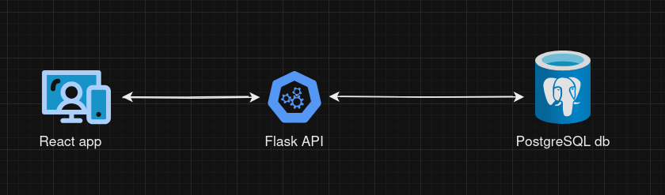

# UOL Fullstack Test


## Hey, check out on my Live Deploy of this project!
You can access it and test it live [Here](https://uol-fullstack-frontend-deploy.vercel.app/). keep in mind this is a challenge happening on 14/11/2024 so if you are a few months away maybe its not up and working as it should.

## Description
This is a Fullstack development project that implements a simple client managment system


- This project is based on a simple microsservice logic that implements three different modules that
can be deployed independently
    1) Frontend Module
        - implemented using Flask(python)
    2) Backend Module
        - implemented using PostgreSQL
    3) Database Module
        - implemented using React(typescript)
and can be better visualized on the following diagram



## This documentation will be partitioned in a few steps
- [Information about the Test](#about-the-test)
- [My Project Decisions on the API](#my-project-decisions-on-the-api)
- [My Project Decisions on the FrontEnd](#my-project-decisions-on-the-frontend)
- [How to run the whole project locally](#how-to-run-the-whole-project-locally)
- [How to run the API (with and without Docker)](#how-to-run-the-api)
- [How to run the FrontEnd](#how-to-run-the-frontend)

## About the Test

#### Basic Success Requirements

both the api and the frontend must be done in this repository
- API
    1) implement create/edit/get endpoints for a client entity
        1) get all registered clients
        2) register a new client with valid data
        3) update existing data of a registered client
        4) store the client data in a persistent manner (the test suggestion was SQLite but i used postgresql)

    2) the client entity should possess the following fields:
        ```json
        {
            "name": "string",
            "email": "string",
            "cpf": "string",
            "cellphone": "string",
            "status": "string"
        }
        ```

- Frontend
    1) implement a page that show a list of clients following the given design
    2) implement a form page in wich the user can register or edit a client
    3) when editing a client, show alerts for invalid data
    4) use the same api done here to receive the client data

#### Basic Code Quality Requirements
- make a clean, well organized and easy to read code. Adopt best practices in development and architecture.

#### Desirable Itens (optional)
1) unit tests
2) additional libraries and frameworks

## My Project Decisions on the Api

My main objective when building this api was making a project with good scalability. One that would be very easy to make future implementations or refactors and as such i prioritized a good amount of modularization, a totally dockerized environment, pre-commit linting logic and also unit tests.

#### Deploy
The deploy of the api was done using the Google Cloud service in a free tier plan and can be tested using the following link on your requests https://uol-fullstack-test-backend-deploy-619783757022.southamerica-east1.run.app the database was also deployed on a different online host service but in order to keep this project deploy stable i will not link it here

PS: Accessing the api deploy link will take you to the swagger documentation of the api so fell free to take a look :)
#### Main Languages, Frameworks and libraries
- Flask
- Python
- Google Cloud
- Docker
- pytest
- SQLAlchemy
- Flask restx
- pre-commit
- psycopg2
- swagger

#### Api File Structure
I chose a simple yet well divided file structure focusing on scalability and future new implementations. All files and functions are distributed based on the following responsabilities

- ```app```
    - ```/controllers```
        - functions that will handle incoming requests, make the appropriate data validations, send it to the /services for proper logic treatment and then, after receiving it back will return it to the request sender
    - ```/services```
        - functions that will handle the business logic of a specific endpoint.
    - ```/repositories```
        - functions that handle specifically database requests
    - ```/errors```
        - error handling methods that make the request go back with a specific error code and message to the request sender when they get triggered
    - ```/models```
        - SQLAlchemy models that will be used to build the database tables and also as a type verificator
    - ```/schemas```
        - entity DTO's
    - ```/utils```
        - functions/folders/files that can be used to assist any other functionality but that is outside of the expected range of responsability of any of the other folders (example: getDateInChinaFn)
- ```tests```
    - ```/mocks```
        - functions/dictionaries that will assist the testing files by creating mocked data
    - ```/unit```
        - unit tests files that will check the working state of functions on ```/service```

## My Project Decisions on the FrontEnd

On the Frontend my main objective was making clean, efficient and easy to maintain code so it ended reflecting a little bit on my choice of libraries and the file structure as well

#### Deploy

The live deploy was done using the vercel hosting service and can be accessed [here 
](https://uol-fullstack-frontend-deploy.vercel.app/)

#### Main Languages, Frameworks and libraries
- React
- Typescript
- Docker
- Tailwind
- tanstack
- zustand
- toastify
- postcss
- eslint
- prettierrc

#### Api File Structure

- /components
    - Reusable UI components, organized by hierarchy
        - /atoms
            - Basic, single-purpose elements.
        - /molecules
            - Combinations of atoms that form more complex UI parts.
- /pages
    - Full-page components representing different routes/views in the app
- /routes
    - Configurations for routing and navigation between pages.
- /services
    - Functions for handling API calls and external data interactions.
- /stores
    - State management logic, including global or shared state across components.
- /types
    - Type definitions (e.g., TypeScript interfaces) used throughout the app.

## How to run the whole project locally
To run this project as a whole locally you can freely chose from one of the following methods:

1) the easy and simple way (docker)

    1) Download and install Docker on your PC
    2) clone this repository using the ```git clone``` command
    3) on the root of the project run the command ```docker compose up --build```

2) the hard and complex way (install and run everything manually)

    1) Download python on your pc
    2) Download node.js on your pc
    3) Download postgresql on your pc
    4) setup postgresql on your pc
    5) clone this repository using the ```git clone``` command
    6) Navigate to the ```/Backend``` folder and install dependencies using the following command ```python
    pip install -r requirements.txt```
    7) Navigate to the frontend folder and run ```npm install``` to install dependencies
    8) Run the backend and frontend individually:
        1) in the Backend project root run ```python main.py```
        2) in the Frontend project root run ```npm start```


## How to run the API
If you want to run only the api without the frontend follow these steps

- if you don't want to use docker follow only the backend related steps [here](#how-to-run-the-whole-project-locally)
1) make sure you have Docker on your PC
2) clone this repository using the ```git clone``` command
3) on the root of the ```/Backend``` folder run ```docker compose up --build```

## How to run the FrontEnd
If you want to run only the frontend without the api follow these steps

- if you don't want to use docker follow only the frontend related steps [here](#how-to-run-the-whole-project-locally)
1) Download and install Docker on your PC
2) clone this repository using the ```git clone``` command
3) on the root of the ```/frontend``` folder run ```docker compose up --build```
